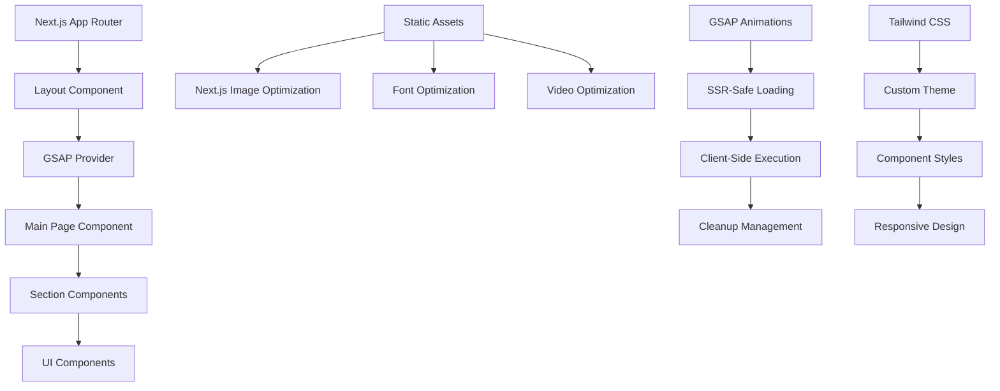

# Design Document

## Overview

This design document outlines the architecture and implementation strategy for migrating the SPYLT protein drink website from Vite.js to Next.js while maintaining pixel-perfect visual fidelity and leveraging Next.js optimization capabilities at the highest level.

## Architecture

### High-Level Architecture



### Technology Stack

- **Framework**: Next.js 14+ with App Router
- **Language**: TypeScript for type safety
- **Styling**: Tailwind CSS v4 with custom theme
- **Animations**: GSAP with ScrollTrigger, ScrollSmoother, SplitText
- **Image Optimization**: Next.js Image component
- **Font Optimization**: Next.js Font optimization
- **State Management**: React hooks and context
- **Performance**: Dynamic imports and code splitting

## Components and Interfaces

### Core Provider Architecture

```typescript
interface GSAPProviderProps {
  children: ReactNode;
}

interface GSAPContextValue {
  isLoaded: boolean;
  registerAnimation: (cleanup: () => void) => void;
  unregisterAnimation: (cleanup: () => void) => void;
}
```

### Component Hierarchy

```
App Layout
├── GSAPProvider (Animation Context)
├── NavBar (Fixed Navigation)
└── Main Content
    ├── HeroSection (Video Background + GSAP Animations)
    ├── MessageSection (ScrollTrigger Animations)
    ├── FlavorSection (Horizontal Scroll + Pin)
    ├── NutritionSection (Complex Layouts)
    ├── BenefitSection (Video Pin + Animations)
    ├── TestimonialSection (Card Animations)
    └── FooterSection (Final Section)
```

### Animation System Design

```typescript
interface AnimationConfig {
  trigger: string;
  start: string;
  end: string;
  scrub?: boolean;
  pin?: boolean;
  onComplete?: () => void;
  onCleanup?: () => void;
}

interface SectionAnimationProps {
  config: AnimationConfig;
  children: ReactNode;
  className?: string;
}
```

### Asset Optimization Strategy

```typescript
interface OptimizedAssetProps {
  src: string;
  alt?: string;
  priority?: boolean;
  quality?: number;
  sizes?: string;
  className?: string;
}

interface VideoOptimizationProps {
  src: string;
  poster?: string;
  autoPlay?: boolean;
  muted?: boolean;
  loop?: boolean;
  playsInline?: boolean;
  className?: string;
}
```

## Data Models

### Animation Timeline Model

```typescript
interface TimelineConfig {
  delay?: number;
  duration?: number;
  ease?: string;
  repeat?: number;
  yoyo?: boolean;
}

interface AnimationStep {
  target: string;
  properties: gsap.TweenVars;
  position?: string;
}

interface TimelineDefinition {
  config: TimelineConfig;
  steps: AnimationStep[];
  scrollTrigger?: ScrollTriggerConfig;
}
```

### Component State Models

```typescript
interface MediaQueryState {
  isMobile: boolean;
  isTablet: boolean;
  isDesktop: boolean;
}

interface AnimationState {
  isInitialized: boolean;
  isPlaying: boolean;
  progress: number;
}

interface SectionState {
  isVisible: boolean;
  hasAnimated: boolean;
  animationProgress: number;
}
```

### Configuration Models

```typescript
interface NextConfigOptimization {
  images: ImageConfig;
  fonts: FontConfig;
  webpack: WebpackConfig;
  headers: HeaderConfig;
}

interface TailwindThemeConfig {
  colors: ColorPalette;
  fontFamily: FontFamilyConfig;
  spacing: SpacingConfig;
  animation: AnimationConfig;
}
```

## Error Handling

### GSAP Error Handling Strategy

```typescript
interface GSAPErrorHandler {
  onPluginLoadError: (plugin: string, error: Error) => void;
  onAnimationError: (animation: string, error: Error) => void;
  onScrollTriggerError: (trigger: string, error: Error) => void;
  onCleanupError: (component: string, error: Error) => void;
}
```

### Fallback Mechanisms

1. **Animation Fallbacks**: CSS transitions for critical animations
2. **Image Fallbacks**: Progressive enhancement for image optimization
3. **Font Fallbacks**: System fonts while custom fonts load
4. **Video Fallbacks**: Static images for video backgrounds on low-end devices

### Error Boundaries

```typescript
interface ErrorBoundaryState {
  hasError: boolean;
  error?: Error;
  errorInfo?: ErrorInfo;
}

interface ErrorBoundaryProps {
  fallback: ComponentType<ErrorBoundaryState>;
  onError?: (error: Error, errorInfo: ErrorInfo) => void;
  children: ReactNode;
}
```

## Testing Strategy

### Visual Regression Testing

1. **Pixel-Perfect Comparison**: Automated screenshot comparison
2. **Cross-Browser Testing**: Chrome, Firefox, Safari, Edge
3. **Responsive Testing**: Multiple device sizes and orientations
4. **Animation Testing**: Frame-by-frame animation validation

### Performance Testing

1. **Core Web Vitals**: LCP, FID, CLS monitoring
2. **Bundle Analysis**: JavaScript payload optimization
3. **Image Optimization**: Format and compression validation
4. **Animation Performance**: 60fps maintenance verification

### Functional Testing

1. **GSAP Integration**: All animations work correctly
2. **Responsive Design**: All breakpoints function properly
3. **Asset Loading**: Images, videos, fonts load optimally
4. **User Interactions**: All interactive elements respond correctly

## Performance Optimization

### Code Splitting Strategy

```typescript
// Dynamic imports for sections
const HeroSection = dynamic(() => import("@/sections/HeroSection"), {
  ssr: false,
  loading: () => <SectionSkeleton />,
});

const FlavorSection = dynamic(() => import("@/sections/FlavorSection"), {
  loading: () => <SectionSkeleton />,
});
```

### Image Optimization

```typescript
// Next.js Image configuration
const imageConfig = {
  formats: ["image/webp", "image/avif"],
  deviceSizes: [640, 750, 828, 1080, 1200, 1920, 2048, 3840],
  imageSizes: [16, 32, 48, 64, 96, 128, 256, 384],
  quality: 90,
  priority: true, // for above-the-fold images
};
```

### Font Optimization

```typescript
// Next.js Font optimization
const antonio = Antonio({
  subsets: ["latin"],
  display: "swap",
  preload: true,
  variable: "--font-antonio",
});

const proximaNova = localFont({
  src: "./fonts/ProximaNova-Regular.otf",
  display: "swap",
  preload: true,
  variable: "--font-proxima-nova",
});
```

### GSAP Performance Optimization

```typescript
// GSAP configuration for optimal performance
gsap.config({
  force3D: true,
  nullTargetWarn: false,
  trialWarn: false,
});

// ScrollTrigger optimization
ScrollTrigger.config({
  limitCallbacks: true,
  syncInterval: 150,
});
```

## Security Considerations

### Content Security Policy

```typescript
const securityHeaders = {
  "Content-Security-Policy": `
    default-src 'self';
    script-src 'self' 'unsafe-inline' 'unsafe-eval';
    style-src 'self' 'unsafe-inline' fonts.googleapis.com;
    font-src 'self' fonts.gstatic.com;
    img-src 'self' data: blob:;
    media-src 'self';
    connect-src 'self';
  `,
  "X-Frame-Options": "DENY",
  "X-Content-Type-Options": "nosniff",
  "Referrer-Policy": "origin-when-cross-origin",
};
```

### Asset Security

1. **Static Asset Validation**: Ensure all assets are properly served
2. **Font License Compliance**: Verify font licensing for web use
3. **GSAP License Validation**: Ensure proper GSAP plugin licensing
4. **Environment Variable Security**: Secure API keys and sensitive data

## Deployment Architecture

### Build Process

```typescript
// Next.js build configuration
const buildConfig = {
  output: "standalone",
  compress: true,
  poweredByHeader: false,
  generateEtags: false,
  distDir: ".next",
};
```

### CDN Strategy

1. **Static Assets**: Images, videos, fonts served via CDN
2. **Cache Headers**: Optimal caching strategies for different asset types
3. **Compression**: Gzip/Brotli compression for text assets
4. **Edge Optimization**: Geographic distribution for global performance

### Monitoring and Analytics

```typescript
interface MonitoringConfig {
  performance: PerformanceMonitoring;
  errors: ErrorTracking;
  analytics: WebAnalytics;
  realUserMonitoring: RUMConfig;
}
```

## Migration Strategy

### Phase 1: Foundation Setup

- Next.js project initialization
- TypeScript configuration
- Tailwind CSS setup
- Basic file structure creation

### Phase 2: Core Infrastructure

- GSAP provider implementation
- Asset optimization setup
- Layout component creation
- Navigation component migration

### Phase 3: Section Migration

- Hero section with video background
- Message section with scroll animations
- Flavor section with horizontal scroll
- Nutrition section with complex layouts

### Phase 4: Advanced Features

- Benefit section with video pinning
- Testimonial section with card animations
- Footer section completion
- Interactive element refinement

### Phase 5: Optimization & Testing

- Performance optimization
- Visual regression testing
- Cross-browser validation
- Production deployment preparation

## Success Metrics

### Visual Fidelity Metrics

- 100% pixel-perfect match in layout comparison
- Identical color values across all elements
- Matching typography metrics (size, weight, spacing)
- Preserved responsive behavior across all breakpoints

### Performance Metrics

- Lighthouse Performance Score: >90
- First Contentful Paint: <1.8s
- Largest Contentful Paint: <2.5s
- Cumulative Layout Shift: <0.1
- Time to Interactive: <3.5s

### Animation Metrics

- 60fps animation performance maintained
- Identical scroll trigger positions
- Matching animation timing and easing
- Zero animation-related memory leaks

### Technical Metrics

- TypeScript compilation with zero errors
- ESLint compliance with zero warnings
- Bundle size optimization (no significant increase)
- Cross-browser compatibility maintained
